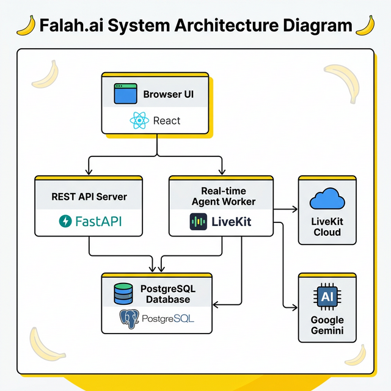

# Falah.ai — AI-Powered Practice Platform

Real-time AI practice platform where you create custom AI personas and have live conversations with them — for sales calls, investor pitches, interviews, onboarding, training, or any scenario you need to sharpen. Powered by **Gemini Live API** (multimodal audio + vision) and **LiveKit WebRTC**.

## Features

- **Custom AI Agents** — Create personas with configurable name, role, personality, focus areas, voice, scoring criteria, and behavior rules
- **Live Sessions** — Real-time audio conversations with screen sharing; the AI can see your screen and respond to what's on it
- **AI Scoring & Transcripts** — Every session is recorded with a full transcript and AI-generated scorecard
- **Community** — Share your agents publicly or discover templates created by others
- **Connectors** — Integrate external context from Gmail, Google Docs, Slack, Salesforce, HubSpot, and Notion
- **Guided Onboarding** — Voice-driven onboarding agent that walks new users through the platform via screen-aware conversation
- **Google OAuth** — Sign in with Google

## Tech Stack

| Layer | Technology |
|-------|-----------|
| Backend | FastAPI, SQLAlchemy (async), Alembic, PostgreSQL |
| AI | Google Gemini 2.5 Flash (native audio + vision) via LiveKit Agents SDK |
| Real-time | LiveKit WebRTC (audio + screen share) |
| Frontend | React 19, Vite, Tailwind CSS v4, Zustand, React Router v7 |
| Auth | JWT + bcrypt, Google OAuth |

## Prerequisites

- **Python 3.12+**
- **Node.js 22+**
- **PostgreSQL**
- **Docker & Docker Compose** (optional)

## Quick Start (Local)

### 1. Clone the repo

```bash
git clone <repo-url>
cd falah
```

### 2. One-time setup

```bash
make setup
```

Creates the Python venv, installs dependencies, scaffolds `.env` files, and runs DB migrations.

> **Windows**: requires [Make for Git Bash](https://chocolatey.org/packages/make) — or use Docker below.

### 3. Fill in your API keys

**`backend/.env`**

| Variable | Description |
|----------|-------------|
| `GOOGLE_API_KEY` | Gemini API key from Google AI Studio |
| `GOOGLE_CLIENT_ID` | Google OAuth client ID |
| `LIVEKIT_URL` | LiveKit server URL (`wss://...`) |
| `LIVEKIT_API_KEY` | LiveKit API key |
| `LIVEKIT_API_SECRET` | LiveKit API secret |
| `DATABASE_URL` | PostgreSQL connection string |
| `SECRET_KEY` | Random hex string — `python -c "import secrets; print(secrets.token_hex(32))"` |
| `CORS_ORIGINS` | Comma-separated allowed origins |

**`frontend/.env`**

| Variable | Description |
|----------|-------------|
| `VITE_API_URL` | Backend API base URL (`http://localhost:8000/api/v1`) |
| `VITE_LIVEKIT_URL` | LiveKit server URL (`wss://...`) |
| `VITE_GOOGLE_CLIENT_ID` | Google OAuth client ID |

### 4. Run everything

```bash
make dev
```

Starts FastAPI server, LiveKit agent worker, and React frontend in one terminal:

```
[api]     INFO:     Uvicorn running on http://localhost:8000
[agent]   INFO:     Connected to LiveKit, waiting for rooms...
[web]     VITE ready on http://localhost:5173
```

### Other commands

| Command | What it runs |
|---|---|
| `make dev` | API + Agent + Frontend |
| `make dev-backend` | API + Agent only |
| `make dev-api` | FastAPI server only |
| `make dev-agent` | LiveKit agent only (raw logs) |
| `make migrate` | Run DB migrations |

## Quick Start (Docker)

```bash
cp .env.example .env
cp backend/.env.example backend/.env
docker compose up --build
```

Frontend at `http://localhost`, backend at `http://localhost:8000`.

## Project Structure

```
falah/
├── backend/
│   ├── app/
│   │   ├── core/           # Config (Pydantic Settings), security (JWT/bcrypt)
│   │   ├── db/             # SQLAlchemy async engine & session
│   │   └── features/       # Modular business logic
│   │       ├── auth/       # Registration, login, Google OAuth, JWT
│   │       ├── personas/   # Agent CRUD, community sharing, templates
│   │       ├── sessions/   # Session tracking, transcripts, AI scoring
│   │       ├── livekit/    # Agent worker, WebRTC token generation
│   │       ├── onboarding/ # Onboarding flow & voice guide agent
│   │       └── context/    # Document upload & context injection
│   ├── alembic/            # DB migrations
│   ├── main.py             # FastAPI entrypoint
│   └── Dockerfile
├── frontend/
│   ├── src/
│   │   ├── app/            # App shell, routing, layout
│   │   ├── pages/          # Route pages (agents, sessions, community, live, auth, connectors, analytics)
│   │   ├── features/       # Feature modules (auth, personas, sessions, livekit, onboarding, context)
│   │   ├── entities/       # Domain types & constants
│   │   ├── widgets/        # Composite UI blocks (scorecard, transcript viewer, dock, etc.)
│   │   └── shared/         # Reusable UI components & utilities
│   ├── package.json
│   └── Dockerfile
├── docker-compose.yml
└── Makefile
```

## Reproducible Testing Instructions

### What You Need

| Service | How to Get It (Free) |
|---------|---------------------|
| **Google Gemini API Key** | [Google AI Studio](https://aistudio.google.com/apikey) — free tier available |
| **Google OAuth Client ID** | [Google Cloud Console](https://console.cloud.google.com/apis/credentials) — create OAuth 2.0 credentials |
| **LiveKit Cloud** | [LiveKit Cloud](https://cloud.livekit.io/) — free tier includes the URL, API key, and secret |
| **PostgreSQL** | Local install, or free [Supabase](https://supabase.com/) / [Neon](https://neon.tech/) hosted DB |

### Option A: Local Setup (Recommended for Testing)

```bash
# 1. Clone and enter the repo
git clone <repo-url>
cd falah

# 2. One-time setup — creates venv, installs deps, scaffolds .env files, runs migrations
make setup

# 3. Fill in your API keys in backend/.env and frontend/.env (see tables above)

# 4. Start all services (API + LiveKit Agent + Frontend)
make dev
```

This starts three processes:
- **API server** at `http://localhost:8000`
- **LiveKit agent worker** (connects to LiveKit Cloud, waits for rooms)
- **React frontend** at `http://localhost:5173`

> **Windows users**: requires Make via [Git Bash](https://chocolatey.org/packages/make) or use Docker (Option B).

### Option B: Docker Setup

```bash
# 1. Copy env templates and fill in your API keys
cp .env.example .env
cp backend/.env.example backend/.env
cp frontend/.env.example frontend/.env

# 2. Build and run
docker compose up --build
```

Frontend at `http://localhost`, backend at `http://localhost:8000`.

### Testing the Core Features

**1. Sign In**
- Open the app and click **Sign in with Google**

**2. Onboarding Agent (voice-guided setup tour)**
- On first login, a voice onboarding agent greets you
- Talk to it — it walks you through the platform via real-time conversation
- Share your screen and the agent can see what you're looking at

**3. Starter Agents (pre-built personas)**
- Go to **Agents** page — two starter agents are available:
  - **Sarah - Tier 1 VC** (investor persona)
  - **David - Enterprise CTO** (sales client persona)
- Click one, then click **Start Session**
- Select your mic/speaker and start a live practice conversation

**4. Create a Custom Agent**
- On the **Agents** page, click **Create Agent**
- Configure name, role, personality, focus areas, voice, and scoring criteria
- Start a session with your custom agent

**5. Session Review**
- After ending a session, go to **Sessions** page
- Each session shows: full transcript, AI-generated scorecard (1-10 per dimension), and an AI summary

**6. Community Sharing**
- On any custom agent's detail page, click **Make Public**
- The agent becomes available on the **Community** page for other users

**7. Connectors (Context Injection)**
- Go to **Connectors** page
- Upload documents (PDF, text) that provide context to your agents during live sessions

### Verifying the AI Features Work

| Feature | How to Verify |
|---------|--------------|
| **Real-time voice** | Start a session — you should hear the AI speak and it should respond to your voice |
| **Screen sharing** | Click the screen share button during a session — the AI will describe what it sees |
| **AI scoring** | End a session — check the Sessions page for the auto-generated scorecard |
| **AI summary** | Each completed session gets a 2-3 sentence summary on the Sessions page |
| **Onboarding resumption** | End the onboarding mid-way, refresh, and re-trigger it — the agent remembers where you left off |

## Architecture



- **Two-process model**: REST API server + LiveKit agent worker run independently
- **Modular features**: Each feature is self-contained with its own models, schemas, router, and service
- **Async throughout**: FastAPI with asyncpg for non-blocking DB calls
- **Context compression**: Intelligent token management for Gemini's context window (trigger at 90K tokens, compress to 45K)
- **Persona snapshots**: Sessions freeze agent config at recording time for immutable analytics
- **Multimodal streaming**: Audio + screen share frames sent to Gemini for real-time vision-aware responses
